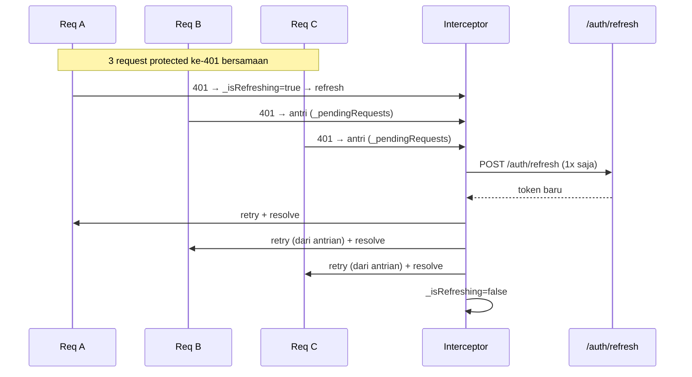

# Auth-Katalog App (Flutter)

Take-home test — Mobile App Developer. Aplikasi auth + katalog yang menonjolkan
pola inti: **auth token + dio interceptor + auto-refresh (single-flight) +
money-path + state async**.

API: [dummyjson.com](https://dummyjson.com) (auth sungguhan).
Credensial test: `emilys` / `emilyspass`.

---

## Cara Run

Prasyarat:
- Flutter SDK ≥ 3.13 (project ini di-build dengan Flutter 3.47 / Dart 3.13)
- Device/emulator atau browser

```bash
flutter pub get
flutter run
```

Menjalankan test (wajib untuk membuktikan single-flight):

```bash
flutter test test/auth_interceptor_test.dart
# atau seluruh test:
flutter test
```

Cek analisis statis (syarat: harus bersih tanpa error):

```bash
flutter analyze
```

Login test: username `emilys`, password `emilyspass`.
> Catatan: login dikirim dengan `expiresInMins: 1` secara sengaja agar access
> token cepat kadaluarsa (≤1 menit) sehingga alur refresh otomatis terpicu.

---

## Cakupan Requirement

| Part | Status | Penjelasan singkat |
|------|--------|--------------------|
| 1. Login + secure storage | ✅ | `auth_repository.login` → `flutter_secure_storage` (`SecureStorageService`) untuk access + refresh token; auto-login via `SplashPage.checkAuth()` |
| 2. Interceptor + auto-refresh single-flight | ✅ | `DioClient` (interceptor) + unit test single-flight |
| 3. Home profil + katalog | ✅ | fetch `/auth/me` + `/products` (pagination/infinite scroll), search debounce 400ms, pull-to-refresh, state loading/empty/error |
| 4. Detail | ✅ | `ProductDetailPage` → `GET /products/{id}` |
| 5. Logout | ✅ | dialog konfirmasi → `clearTokens()` → kembali ke login |
| 6. Arsitektur & model | ✅ | data layer ↔ presentation terpisah; model `freezed` + `json_serializable` |

---

## Arsitektur & Keputusan

### Struktur folder
```
lib/
  core/
    constants/api_contant.dart     # endpoint & base url
    theme/app_theme.dart           # tema (Material 3)
    utils/
      currency_formatter.dart      # format Rupiah
      debouncer.dart               # debounce search
      error_handler.dart           # mapping DioException → pesan ramah user
  data/
    models/                        # freezed + json_serializable
      auth_response_model.dart, user_model.dart, product_model.dart
    services/
      dio_client.dart              # Dio + Interceptor (single-flight)
      secure_storage_service.dart  # flutter_secure_storage
    repositories/
      auth_repository.dart, product_repository.dart
  presentation/
    controllers/                   # Riverpod StateNotifier (state async)
      auth_controller.dart, home_controller.dart, product_detail_controller.dart
    pages/                         # login, splash, home, profile, product_detail
    widgets/                       # product_card, app_button, app_text_field
test/
  auth_interceptor_test.dart       # bukti single-flight
```

### Data layer vs Presentation (Part 6)
- **Data layer**: `DioClient` (HTTP + interceptor), `SecureStorageService`
  (penyimpanan), `AuthRepository`/`ProductRepository` (orkestrasi endpoint +
  parsing JSON via model), dan `models/`.
- **Presentation layer**: `controllers/*` (Riverpod `StateNotifier`) memegang
  state async (loading/empty/error/data) dan memanggil repository; `pages/*`
  & `widgets/*` **hanya merender UI** dan membaca/mengirim event ke controller.
- **Tidak ada** `Dio()`, call API, atau parsing JSON manual di dalam widget.
  Satu-satunya yang tahu bentuk JSON adalah `fromJson` di dalam model.

### State Management — Riverpod
State dikelola dengan `StateNotifier` + `StateNotifierProvider` (immutable
state lewat `freezed`). Dependency (repository) di-inject lewat
`ProviderScope(overrides: ...)` di `main.dart` agar mudah di-mock saat test.
> Catatan versi: project memakai Riverpod 3.x; `StateNotifier` di v3 masuk ke
> `package:riverpod/legacy.dart`. Masih didukung & berfungsi, namun ke depan
> lebih idiomatik beralih ke `Notifier`/`AsyncNotifier` atau code-gen.

### Model — freezed + json_serializable (Part 6)
Dipilih karena:
- Immutable & null-safe by default (`@Default`, union type).
- Generator `build_runner` menghasilkan `fromJson`/`toJson` konsisten,
  mengurangi boilerplate & human-error saat mapping field API.
- `copyWith` otomatis → update state di controller jadi bersih.

### Penyimpanan token — flutter_secure_storage (bukan SharedPreferences)
Token disimpan di keystore/keychain (terenkripsi) via
`SecureStorageService`. SharedPreferences plaintext dilarang oleh rubrik.

---

## Cara Kerja Single-Flight Refresh (Part 2 — inti)

Alur ada di `lib/data/services/dio_client.dart`:

1. **onRequest**: setiap request menyisipkan `Authorization: Bearer <accessToken>`
   yang diambil dari secure storage.
2. **onError** mendeteksi `401` (token kedaluwarsa/absen):
   - Jika sedang refresh (`_isRefreshing == true`), request **diantrikan**
     ke `_pendingRequests` (menyimpan `RequestOptions` + `handler`-nya) →
     **tidak** memicu refresh kedua.
   - Jika belum refresh: set `_isRefreshing = true`, lalu **SEKALI** panggil
     `POST /auth/refresh` (lewat `_refreshDio` terpisah agar tidak memicu
     interceptor recursively), simpan token baru, lalu:
     - retry request pemicu 401, dan
     - iterasi `_pendingRequests` → retry semua request yang mengantri.
   - Terakhir (`finally`) reset `_isRefreshing = false`.
3. **Jika refresh gagal** (refresh token invalid): `clearTokens()`, reject
   request pemicu **dan semua yang mengantri** (agar future-nya tidak hang),
   lalu panggil callback `onLogout` → `navigatorKey.pushAndRemoveUntil(LoginPage)`
   di `main.dart`. Jadi user dikembalikan ke layar login bersih.



**Bukti via test** (`test/auth_interceptor_test.dart`): menembak ≥3 request
protected berbarengan dalam kondisi 401 (mock adapter mengembalikan 401 untuk
token lama, 200 setelah refresh). Assert: `/auth/refresh` dipanggil **tepat 1×**
(`refreshCallCount == 1`) dan **semua** request sukses (bukan `DioException`).
Test ini lolos (`flutter test`).

---

## Money-path (Part 3 / 15 poin)

`CurrencyFormatter.toRupiah(double)` memakai `intl` +
`NumberFormat.currency(locale: 'id_ID', symbol: 'Rp', decimalDigits: 0)` →
pemisah ribuan + format Rupiah (mis. `Rp1.250.000`), konsisten di
`ProductCard` & `ProductDetailPage`.
> **Asumsi (dongak di README per rubrik):** nilai `price` dari API
> **diformat langsung** sebagai Rupiah tanpa konversi kurs buatan, agar tidak
> memanipulasi nilai. dummyjson mengembalikan harga dalam satuan kecil, sehingga
> tampil sebagai angka Rupiah mentah. Jika ingin konversi USD→Rp, gunakan konstanta
> kurs eksplisit (mis. `const double kursUsdKeRupiah = 15000`) yang didokumentasikan,
> bukan hardcode tersembunyi.

---

## Waktu Pengerjaan

Estimasi **~7 jam** (dalam range 6–8 jam dari brief). Mayoritas waktu pada
interceptor single-flight + test, serta penyelesaian state async UI.

---

## Kalau Ada Waktu Lebih, Yang Mau Diperbaiki

- Beralih ke Riverpod 3 idiomatik (`Notifier`/`AsyncNotifier` atau code-gen)
  menggantikan `StateNotifier` legacy.
- Refresh token rotation: simpan `refreshToken` baru ke storage **sebelum**
  retry agar lebih aman jika app tertutup di tengah refresh.
- Tambahkan **widget test** (login, search, detail) dan **CI GitHub Actions**
  (`flutter analyze` + `flutter test`).
- Dark theme + animasi transisi antar layar.
- Biarkan `onLogout` juga me-reset `authController` state secara eksplisit
  (saat ini andalkan navigasi + storage bersih).
- Robustness single-flight: hindari kemungkinan chained-401 pada request yang
  mengantri (saat ini aman karena token baru valid).

---

## Bonus

- ✅ **Handling offline**: `error_handler.dart` membedakan
  `connectionError`/"no internet" vs `badResponse`/"server error" dengan
  pesan berbeda.
- ⬜ Dark theme, widget test, CI, animasi transisi → belum dikerjakan.

---

## Checklist Red-Flag (rubrik)

- ❌ Token di SharedPreferences? → **Tidak**, pakai `flutter_secure_storage`.
- ❌ `Dio()` di-new di widget? → **Tidak**, semua lewat `DioClient`/repository.
- ❌ Parsing JSON manual di `build()`? → **Tidak**, hanya di `fromJson` model.
- ❌ Layar blank saat gagal? → **Tidak**, selalu ada state error + "Coba Lagi".
- ❌ Harga `price.toString()` tanpa pemisah? → **Tidak**, pakai `NumberFormat`
  Rupiah (pemisah ribuan).
- ❌ Mock/dummy data di UI? → **Tidak**, semua dari API sungguhan.
